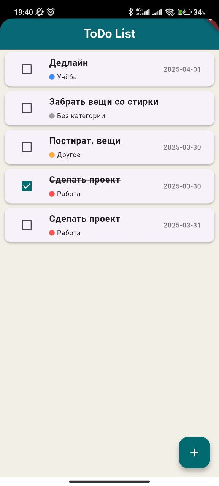
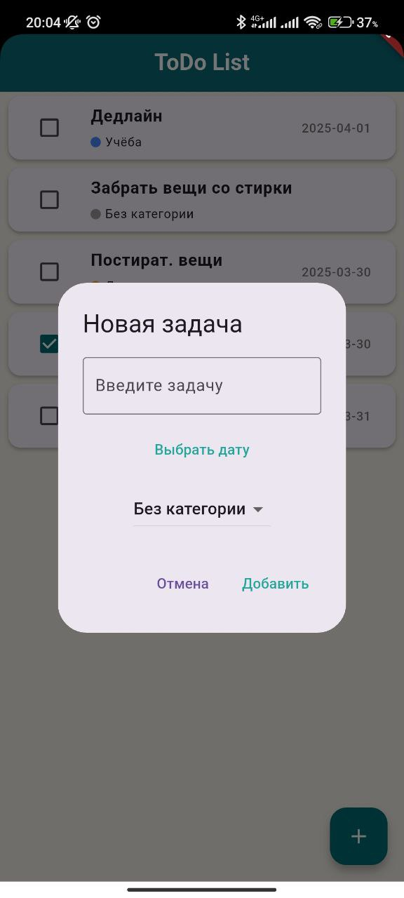
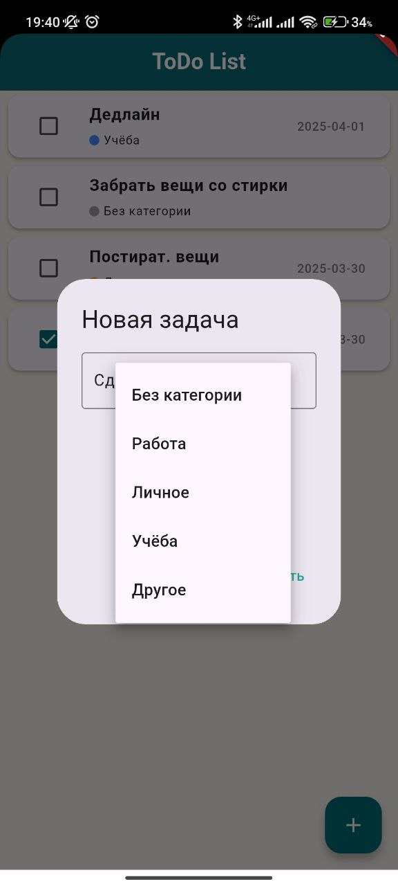
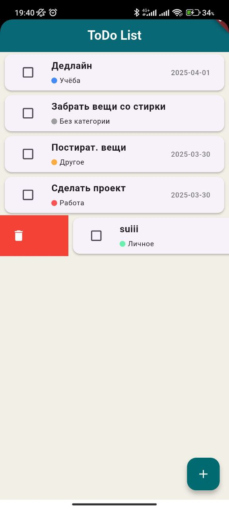

# 📝 ToDo List App

Простое и удобное приложение для ведения списка задач на Flutter. Позволяет добавлять, редактировать, удалять задачи, устанавливать дату выполнения и категории. Сохранение данных осуществляется с помощью `SharedPreferences`.

## 🚀 Функциональность

✅ Добавление новых задач  
✅ Редактирование существующих задач  
✅ Удаление задач  
✅ Установка даты выполнения  
✅ Категоризация задач  
✅ Сохранение данных через `SharedPreferences`

---

## 🛠️ Технологии

- **Flutter** — UI-фреймворк для кроссплатформенной разработки
- **Dart** — язык программирования
- **SharedPreferences** — локальное хранилище данных

---

## 📥 Установка и запуск

### 1. Убедитесь, что Flutter установлен

[Установка Flutter](https://docs.flutter.dev/get-started/install)

### 2. Клонируйте репозиторий

```bash
git clone https://github.com/yourusername/todo_list_app.git
```

### 3. Перейдите в папку проекта

```bash
cd todo_list_app
```

### 4. Установите зависимости

```bash
flutter pub get
```

### 5. Запустите приложение

```bash
flutter run
```

## 👨‍💻 Автор

**Сейфулла Тілеухан**

 [GitHub](https://github.com/Tileukhan)  [Linkedin](https://www.linkedin.com/in/tileukhan-seifulla-7934572a3/)

📸 Скриншоты
 |  |  | 
